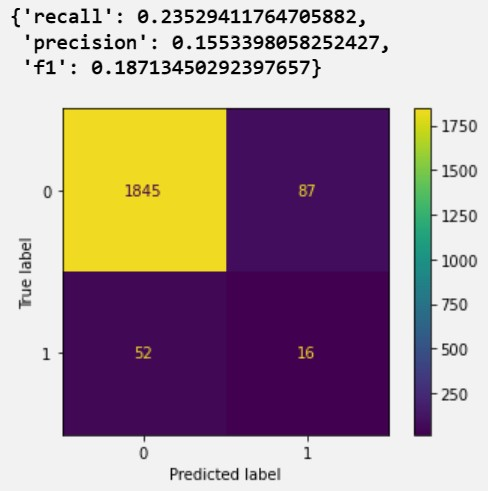

# Lighthouse Labs Final Project

This is the back-to-back capstone project in Lighthouse Labs Data Science bootcamp after 10-week intensive DS training. 

*- Source: [Lighthouse Labs](https://www.lighthouselabs.ca/)*

## Topic: Predictive/Preventive Maintenance

### Introduction and Motivation

Machine failure is unpleasant and unproductive. The production line or business operation has to halt days or weeks  until the machine is back to normal. This can incur a huge lost to businesses.

Predictive maintenance is ML/AI-based program that is capable of monitoring the behavior of a machine, or machine component, predicting or "foreseeing" machine failure, and thus allowing the opportunities to take preventative measures.

Such preventative actions can bring substantial benefits to businesses whose business operation relies on expensive machine/device, such as manufacturing, telecoms, healcare systems, etc. Furthermose, the use case of this technique don't just limit to detecting machine failure. There are many business cases that are similar to this problem domain, which can be generalized to detect anomaly events, such as fraud detection, image denoising, cypersecurity, etc.

*- Source: [PCI](https://www.pcimag.com/articles/106046-predictive-maintenance-and-its-role-in-improving-efficiency)*

### The Challenges
There are quite a few challenges, which can make failure prediction inaccurate, as outlined below:
1. In most cases, the dataset is extremely imbalanced since anomaly usually are rare events. This makes ML/AI struggle to make the classifications.
2. Oversampling or undersampling techniques may not be helpful.
3. The distribution of the normal case may overlap with the distribution of the anomaly case, which makes the seperation difficult resulting in low performance in modeling.
4. The feature space may be small, which may hinder the ML/AI model to find accurate underlying patterns. 

### Dataset

This dataset is taken from [UCI-Machine Learning Depository](https://archive.ics.uci.edu/ml/datasets/AI4I+2020+Predictive+Maintenance+Dataset#)

The original credit goes to : Stephan Matzka, School of Engineering - Technology and Life, Hochschule für Technik und Wirtschaft Berlin, 12459 Berlin, Germany, stephan.matzka'@'htw-berlin.de

#### This dataset is a synthesized dataset that mimics the real predictive maintenance data that gathers from certain device, as quotes here:
> *Since real predictive maintenance datasets are generally difficult to obtain and in particular difficult to publish, we present and provide a synthetic dataset that reflects real predictive maintenance encountered in industry to the best of our knowledge.*

#### Here are the detailed dataset description :
The dataset consists of 10 000 data points stored as rows with 14 features in columns

- `UID`: unique identifier ranging from 1 to 10000
- `Product ID`: consisting of a letter L, M, or H for low (50% of all products), medium (30%) and high (20%) as product quality variants and a variant-specific serial number
- `Air temperature [K]`: generated using a random walk process later normalized to a standard deviation of 2 K around 300 K
- `Process temperature [K]`: generated using a random walk process normalized to a standard deviation of 1 K, added to the air temperature plus 10 K.
- `Rotational speed [rpm]`: calculated from a power of 2860 W, overlaid with a normally distributed noise
- `Torque [Nm]`: torque values are normally distributed around 40 Nm with a σ = 10 Nm and no negative values.
- `Tool wear [min]`: The quality variants H/M/L add 5/3/2 minutes of tool wear to the used tool in the process. and a
- `Machine failure`: label that indicates, whether the machine has failed in this particular datapoint for any of the following failure modes are true.

#### The machine failure consists of five independent failure modes

- tool wear failure (`TWF`): the tool will be replaced of fail at a randomly selected tool wear time between 200 – 240 mins (120 times in our dataset). At this point in time, the tool is replaced 69 times, and fails 51 times (randomly assigned).
- heat dissipation failure (`HDF`): heat dissipation causes a process failure, if the difference between air- and process temperature is below 8.6 K and the tool’s rotational speed is below 1380 rpm. This is the case for 115 data points.
- power failure (`PWF`): the product of torque and rotational speed (in rad/s) equals the power required for the process. If this power is below 3500 W or above 9000 W, the process fails, which is the case 95 times in our dataset.
- overstrain failure (`OSF`): if the product of tool wear and torque exceeds 11,000 minNm for the L product variant (12,000 M, 13,000 H), the process fails due to overstrain. This is true for 98 datapoints.
- random failures (`RNF`): each process has a chance of 0,1 % to fail regardless of its process parameters. This is the case for only 5 datapoints, less than could be expected for 10,000 datapoints in our dataset.

(Note: This project does not take into the consideration to these different failure modes)

If at least one of the above failure modes is true, the process fails and the `Machine failure` label is set to 1. It is therefore not transparent to the machine learning method, which of the failure modes has caused the process to fail.

### Approaches
Since the dataset in this domain usually consists of mostly numerical values, the feature engineering is usually not so required, and the preprocessing steps are also minimal. We sould only use one-hot encoding for categories and scaling techniques for numerics.

#### Three different approaches
- Classic Machine Learning
- Artificial Neural Network/Deep Learning
- Autoencoders

#### Procedure
1. Exploratory Data Analysis
2. Build a baseline model - Logistic Regression
   - Use soft decision
3. Build a Machine Learning model - Random Forest
   - Use soft decision
4. Build a Deep Learning model - MLP 
5. Build an Autoencoder model - Undercomplete model

#### Metrics used
- Recall
- Precision
- F1

### Findings

#### EDA
The percentage of failure is about 3.4%

The pair-wised distribution shown here:

#### Baseline Model
Performance:

#### Random Forest
Performance:

*- Note: ROC curve is used to find the cutoff threshold for soft decision in both Logistic Regression and Random Forest.*

#### Deep Learning

Training process: 

The following graph shows the recall and false positive metrics used in DL training on both Training set and validation set.

Performance:

#### Autoencoder

Training loss:

Performance:

This result is interesting and beyond our expectations. As Autoencoder has been recently used for extremely rare anomaly detection; however, our result is really suffering compared to the model above. As thus, we tried many different architectures, different metrics, and other configurations, the result is still barely improving. After a few days trying to figure out where the problem is, we plot the distribution for reconstruction loss in normal and anomaly data as below:

We came up with some conclusions:
- This could be due to non-separable underlying patterns
- Feature dimensionality is too low since we only have eight features
- May need more data points

### Tools used

- Scikit-Learn
- Tensorflow Keras
- Matplotlib.pyplot
- Seaborn

### Folders and Files
- **data**: Where the dataset is located
- **dl_model**: The persisted trained Deep Learning model
- **images**: images used for this README
- **1.0 Exploratory Data Analysis.ipynb**: EDA analysis
- **2.0 Creating a Baseline Model.ipynb**: Baseline model creation
- **3.0 Random Forest Model.ipynb**: Random Forest model creation
- **4.0 Deep Learning Model.ipynb**: Deep neural network learning model creation
- **5.0 Autoencoder Model.ipynb**: Autoencoder model creation
- **help_function.py**: Various refactored help functions used in all modeling tasks to make the code "DRY", and looking good

### What can go Further:
- Combination of Online and Active Learning
- Unsupervised anomaly detection
- Various different kind of autoencoders

### Reference
- Dua, D. and Graff, C. (2019). UCI Machine Learning Repository [http://archive.ics.uci.edu/ml]. Irvine, CA: University of California, School of Information and Computer Science.

### Acknowledgement
- My deepest gratitude goes to the support from the XTAP program from [Invest Ottawa](https://www.investottawa.ca/), who makes my learning and thus this project possible!! 
- The DS learning journey in [Lighthouse Labs](https://www.lighthouselabs.ca/) is truly exclusive. It was challenging and fun. The design of the bootcamp can really accelerate the learning that I have never experienced before making me a well-rounded prosperous Data Scientist. Deeply grateful for offering such wonderful bootcamp!!

